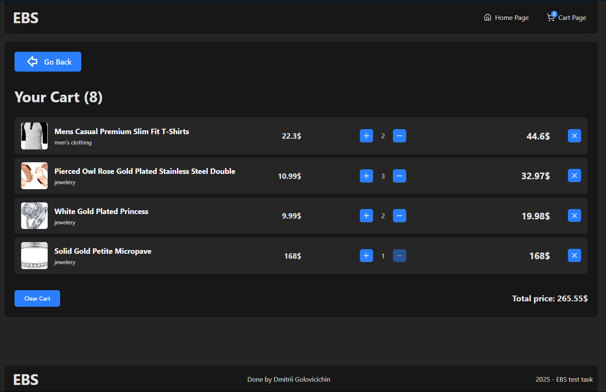

# Product Catalog Application

This is a simple React application built with TypeScript that showcases a product catalog. Users can browse products, filter by category, sort by price, add items to a shopping cart, and manage their cart. The app demonstrates effective use of React hooks, Context API for global state, React Router for navigation, and integration with a public API.

Additionally, the app includes a dedicated product details page and is fully responsive for mobile and desktop screens.

## Previews

Home Page


Product Page


Cart Page



## Features

- **Home Page (/)**

  - Displays a list of products as cards, showing product image, name, price, and category.

  - Supports filtering products by category and sorting by price (ascending/descending).

- **Shopping Cart Page (/cart)**

  - Lists all products added to the cart, showing quantity controls, remove buttons, and total price calculation.

  - Includes a “Clear Cart” button to empty the entire cart.

- **Product Details Page (/product/:id)**

  - View detailed information about a single product, including image, title, description, price, and category.

  - Users can add the product to the cart from this page.

## Technical Implementation

**Core Features**:

- Uses React with TypeScript for type safety and maintainability.

- Fetches product data dynamically from the [Fake Store API](https://fakestoreapi.com).

- Manages global cart state via React Context API.

- Navigation handled by React Router (/, /cart, /product/:id).

- Components are reusable and well-typed with clear interfaces.

- Basic styling applied using Tailwind-CSS with responsive layout adjustments for mobile devices.

## Additional Features

- Responsive design ensuring usability on mobile and desktop devices.

- Basic error handling and loading states during API calls.

## Getting Started

### Prerequisites

- Node.js (version 16 or later recommended)

- npm or yarn

### Installation

1. Clone the repository:

    ```bash
    git clone https://github.com/your-username/product-catalog-app.git
    cd product-catalog-app
    ```

2. Install dependencies:

    ```bash
    npm install
    ```

3. Run the development server:

    ```bash
    npm run dev
    ```

4. Setup the environment variables:

    ```bash
    VITE_PUBLIC_API_URL=https://fakestoreapi.com
    ```

5. Start the development server:

    ```bash
    npm run dev
    ```

6. Open your browser at (<http://localhost:5173>) (or the port specified in the terminal).

## Project Structure

- `src/components/` — Reusable UI components (Button, Card, etc.)

- `src/routes/` — React Router routes configuration

- `src/pages/` — Page components (Home, Cart, Product Details)

- `src/contexts/` — React Context for cart state management

- `src/services/` — API service for fetching product data

- `src/assets/styles/` — CSS styles and responsive rules

- `src/utils/` — Utility functions

- `src/App.tsx` — Main app component with routing setup

## Testing

- Basic unit tests for Button implemented using React Testing Library and Jest.

Thank you for reviewing this project!
